# Sơ Đồ Kiến Trúc Chi Tiết: CLIP ViT-B-16 & BEiT3

> Tài liệu này mô tả chi tiết kiến trúc của hai mô hình đang sử dụng trong dự án Image-Text Retrieval

---

## 📋 Mục Lục

1. [CLIP ViT-B-16 Architecture](#1-clip-vit-b-16-architecture)
   - [Vision Transformer](#vision-transformer-vit-b-16)
   - [Text Transformer](#text-transformer)
   - [Contrastive Learning Flow](#contrastive-learning-flow)
2. [BEiT3 Architecture](#2-beit3-architecture)
   - [Multiway Transformer](#multiway-transformer)
   - [Embedding Modules](#embedding-modules)
   - [Task-Specific Heads](#task-specific-heads)
3. [Rank Fusion System](#3-rank-fusion-system)
4. [Detailed Specifications](#4-detailed-specifications)

---

## 1. CLIP ViT-B-16 Architecture

### Vision Transformer (ViT-B-16)

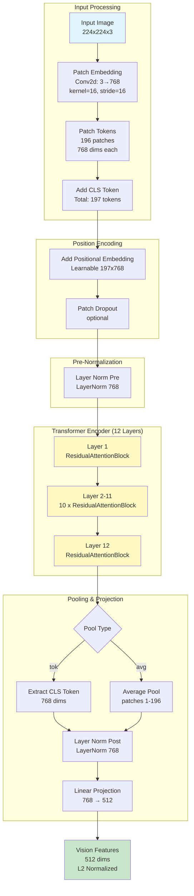

### ResidualAttentionBlock Details

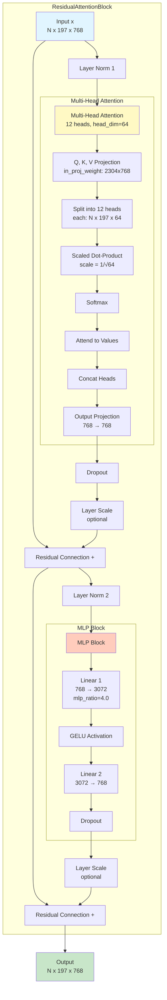

### Text Transformer

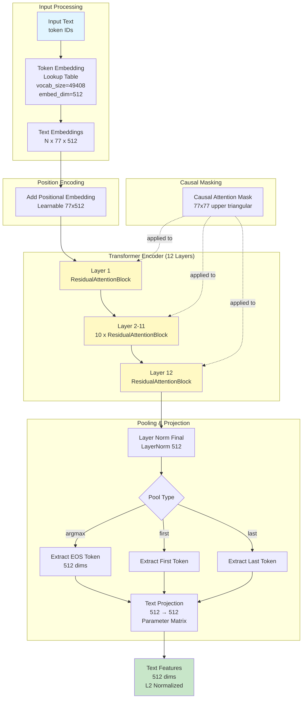

### Text ResidualAttentionBlock Details

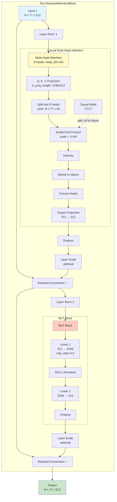

### Contrastive Learning Flow

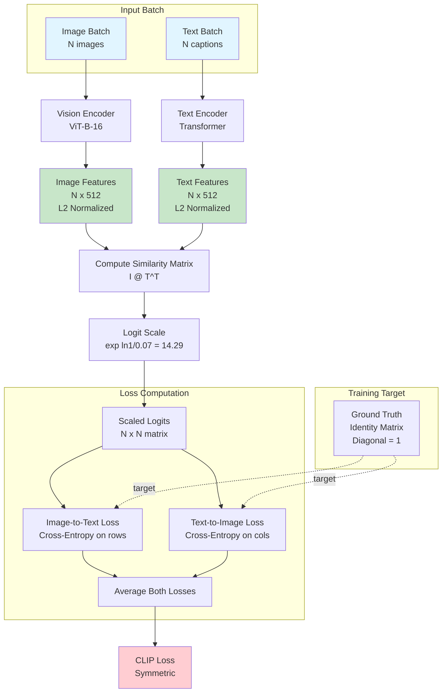

---

## 2. BEiT3 Architecture

### Multiway Transformer

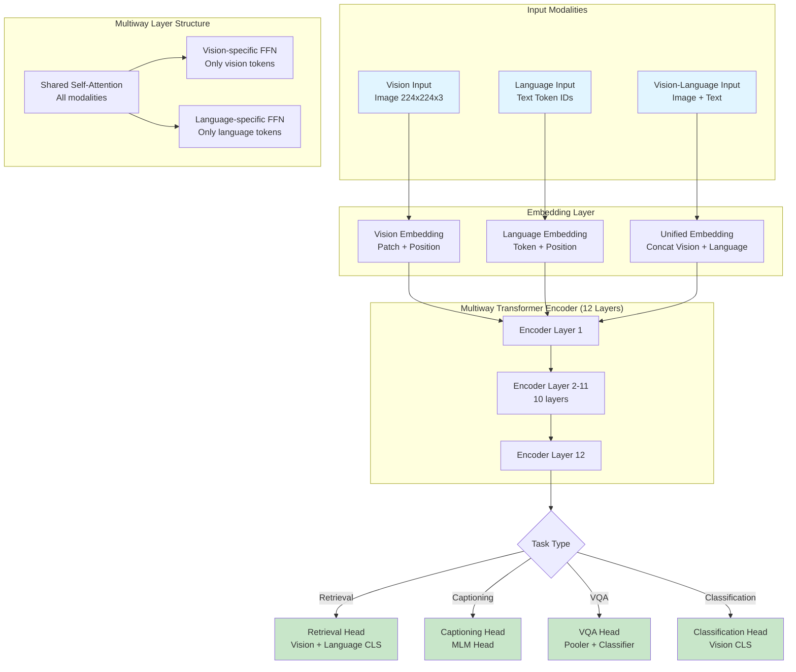

### BEiT3 Embedding Modules

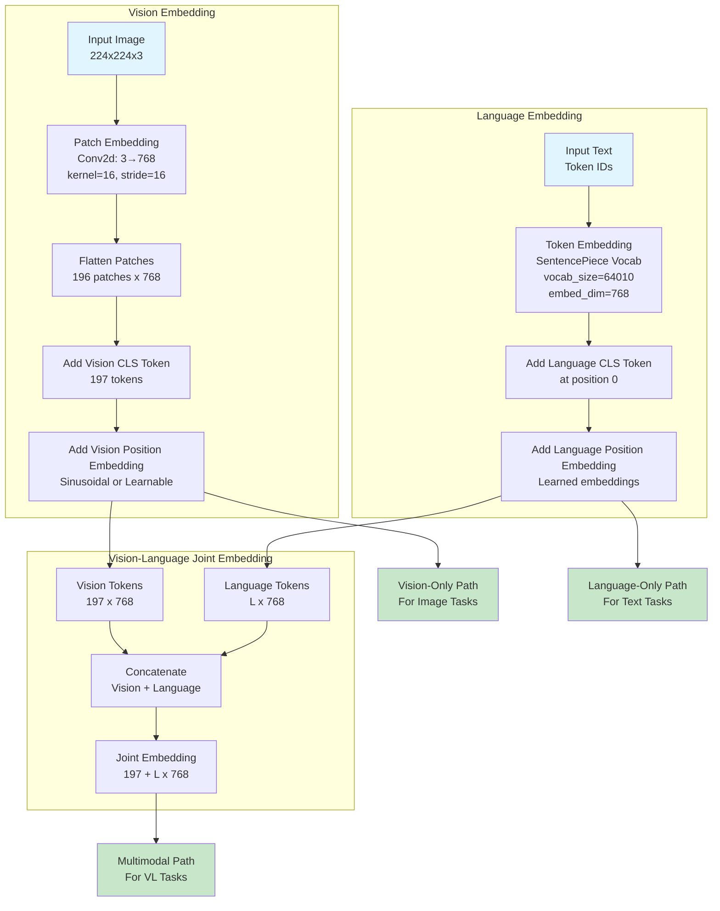

### BEiT3 Encoder Layer (Multiway)

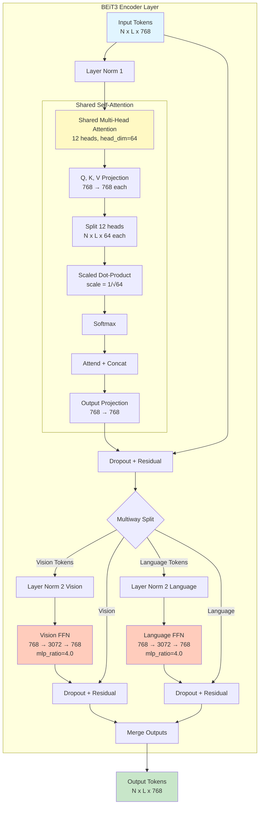

### Task-Specific Heads

```mermaid
graph TB
    subgraph "BEiT3ForRetrieval"
        A[Encoder Output<br/>N x L x 768] --> B{Split Modalities}
        B -->|Vision CLS| C[Vision Head<br/>Linear 768→768]
        B -->|Language CLS| D[Language Head<br/>Linear 768→768]
        C --> E[L2 Normalize<br/>Vision Features]
        D --> F[L2 Normalize<br/>Language Features]
        E --> G[Cosine Similarity<br/>V @ L^T]
        F --> G
        G --> H[Logit Scale<br/>exp ln1/0.07]
        H --> I[CLIP Loss<br/>Contrastive]
    end
    
    subgraph "BEiT3ForCaptioning"
        J[Encoder Output<br/>with Causal Mask] --> K[Extract Text Tokens<br/>after image_len]
        K --> L[Masked LM Head<br/>Linear 768→64010]
        L --> M[Vocabulary Logits]
        M --> N[Cross-Entropy Loss<br/>vs Ground Truth]
    end
    
    subgraph "BEiT3ForVQA"
        O[Encoder Output] --> P[Pooler<br/>CLS → Dense → Tanh]
        P --> Q[Classifier Head<br/>768 → 1536 → 3129]
        Q --> R[VQA Answer Logits]
    end
    
    subgraph "BEiT3ForImageClassification"
        S[Encoder Output<br/>Vision Only] --> T[Average Pool<br/>patches 1-196]
        T --> U[Layer Norm]
        U --> V[Classification Head<br/>768 → num_classes]
    end
    
    style I fill:#c8e6c9
    style N fill:#c8e6c9
    style R fill=#c8e6c9
    style V fill:#c8e6c9
```

---

## 3. Rank Fusion System

### Fusion Architecture

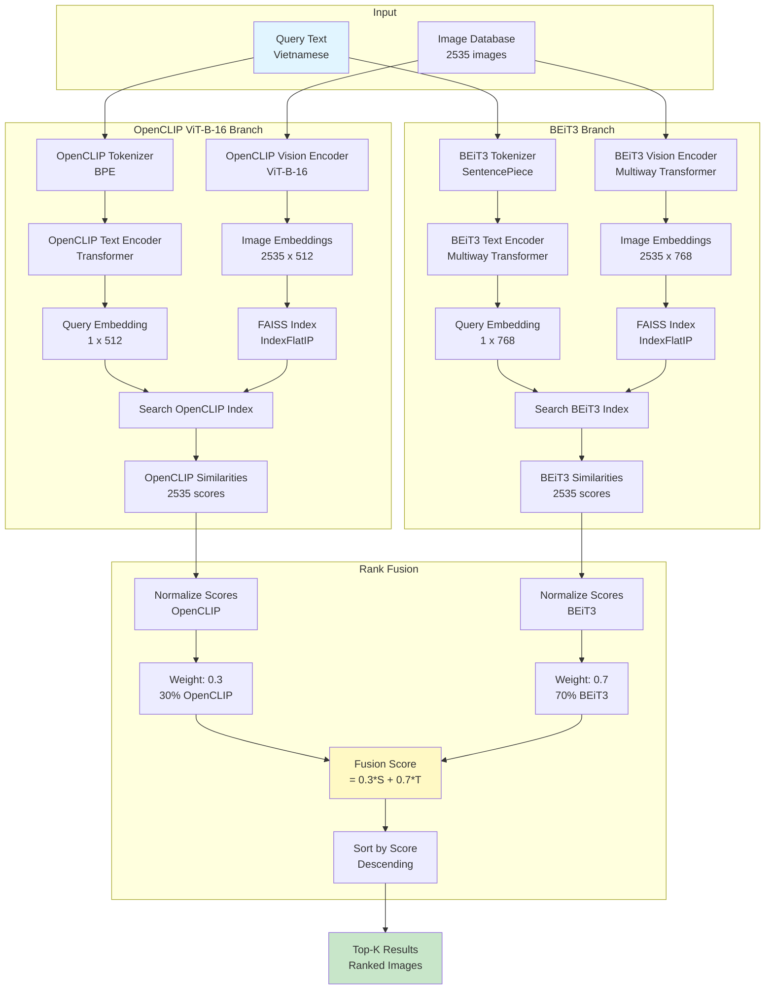

### Fusion Evaluation Pipeline

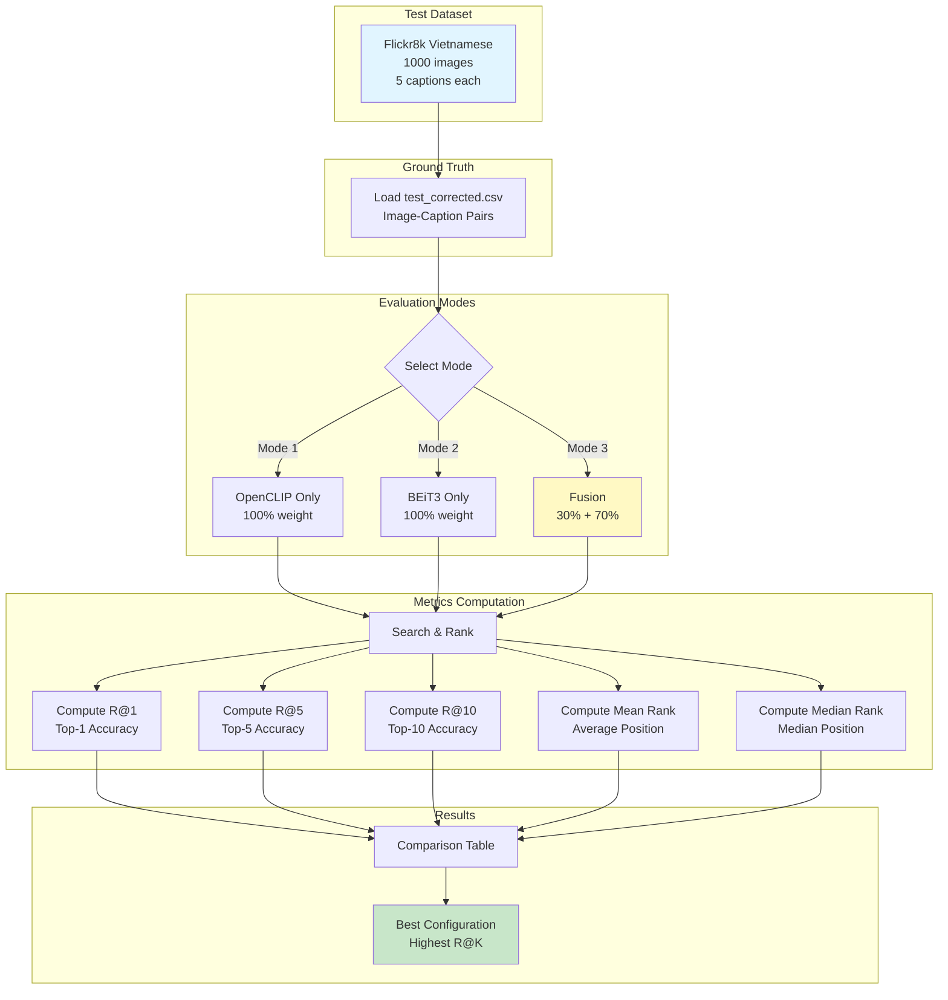

---

## 4. Detailed Specifications

### CLIP ViT-B-16 Specifications

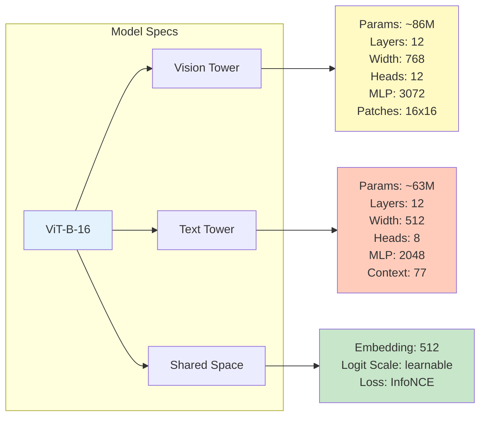

### BEiT3 Base Specifications

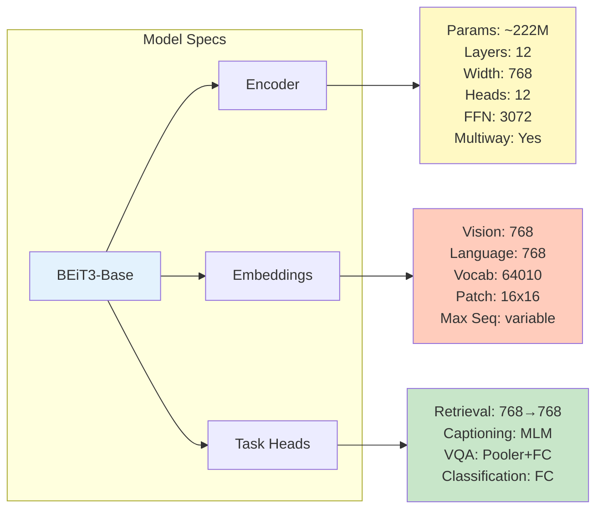

### Parameter Count Breakdown

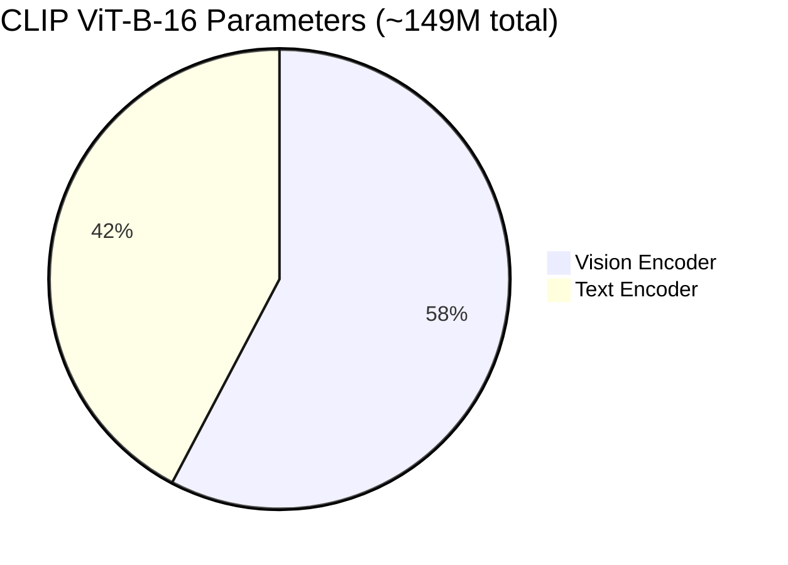

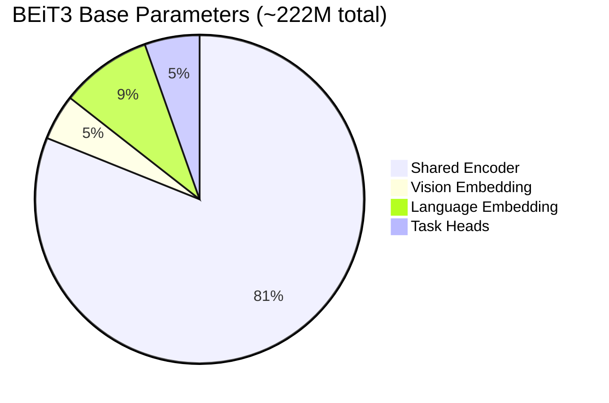

### Attention Mechanism Comparison

| Component | CLIP ViT-B-16 | BEiT3 Base |
|-----------|---------------|------------|
| **Vision Heads** | 12 heads × 64 dims | 12 heads × 64 dims |
| **Text Heads** | 8 heads × 64 dims | 12 heads × 64 dims |
| **Attention Type** | Bidirectional (Vision)<br/>Causal (Text) | Bidirectional (both)<br/>Causal (captioning only) |
| **QKV Projection** | Separate per modality | Shared in encoder |
| **FFN** | Separate per modality | Multiway (modality-specific) |
| **Position Encoding** | Learnable | Learnable + Sinusoidal |

### Data Flow Dimensions

#### CLIP Vision Path:
```
Input Image (3×224×224)
    ↓ Patch Embedding
Patches (196×768)
    ↓ Add CLS + Pos
Tokens (197×768)
    ↓ Transformer (12 layers)
Features (197×768)
    ↓ Pool CLS
Pooled (768)
    ↓ Project
Output (512) → L2 Normalized
```

#### CLIP Text Path:
```
Input Text (77 token IDs)
    ↓ Token Embedding
Embeddings (77×512)
    ↓ Add Pos
Tokens (77×512)
    ↓ Transformer (12 layers)
Features (77×512)
    ↓ Pool EOS
Pooled (512)
    ↓ Project
Output (512) → L2 Normalized
```

#### BEiT3 Vision Path:
```
Input Image (3×224×224)
    ↓ Patch Embedding
Patches (196×768)
    ↓ Add CLS + Pos
Tokens (197×768)
    ↓ Multiway Transformer (12 layers)
Features (197×768)
    ↓ Extract CLS
Pooled (768)
    ↓ Vision Head
Output (768) → L2 Normalized
```

#### BEiT3 Language Path:
```
Input Text (L token IDs)
    ↓ Token Embedding (SentencePiece)
Embeddings (L×768)
    ↓ Add CLS + Pos
Tokens (L×768)
    ↓ Multiway Transformer (12 layers)
Features (L×768)
    ↓ Extract CLS
Pooled (768)
    ↓ Language Head
Output (768) → L2 Normalized
```

#### BEiT3 Vision-Language Path:
```
Image (3×224×224) + Text (L token IDs)
    ↓ Separate Embeddings
Vision (197×768) + Language (L×768)
    ↓ Concatenate
Joint (197+L×768)
    ↓ Multiway Transformer (12 layers)
Joint Features (197+L×768)
    ↓ Task-specific pooling
Output (task-dependent)
```

---

## 📊 Performance Characteristics

### Computational Complexity

| Model | FLOPs (forward) | Parameters | Memory (fp32) | Inference Speed |
|-------|-----------------|------------|---------------|-----------------|
| **CLIP ViT-B-16** | ~17.6 GFLOPs | 149M | ~600 MB | Fast |
| **BEiT3 Base** | ~22.4 GFLOPs | 222M | ~900 MB | Medium |
| **Rank Fusion** | ~40 GFLOPs | 371M | ~1.5 GB | Medium |

### Training Characteristics

| Aspect | CLIP | BEiT3 |
|--------|------|-------|
| **Pretraining Data** | 400M image-text pairs | Large-scale multimodal |
| **Training Objective** | Contrastive (InfoNCE) | Masked Language/Image Modeling |
| **Batch Size** | Large (32k+) | Medium (2k-8k) |
| **Learning Rate** | 5e-4 | 1e-3 (with warmup) |
| **Optimizer** | AdamW | AdamW |
| **Augmentation** | RandomResizedCrop, ColorJitter | Similar + MIM |

---

## 🎯 Use Cases per Model

### CLIP ViT-B-16
✅ **Best for:**
- Zero-shot image classification
- Fast image-text retrieval
- Cross-modal similarity search
- Real-time applications

⚠️ **Limitations:**
- Lower dimensional embeddings (512)
- Less multilingual capability
- No generative tasks

### BEiT3
✅ **Best for:**
- Multimodal understanding
- Image captioning
- Visual Question Answering
- Fine-grained vision-language tasks

⚠️ **Limitations:**
- Slower inference
- Higher memory usage
- Requires more compute

### Rank Fusion
✅ **Best for:**
- Maximum retrieval accuracy
- Leveraging complementary strengths
- Production systems with quality priority

⚠️ **Limitations:**
- 2x inference cost
- Complex deployment
- Requires both models

---

## 📚 References

- **CLIP Paper**: [Learning Transferable Visual Models From Natural Language Supervision](https://arxiv.org/abs/2103.00020)
- **BEiT3 Paper**: [Image as a Foreign Language: BEiT Pretraining for Vision and Vision-Language Tasks](https://arxiv.org/abs/2208.10442)
- **OpenCLIP**: [open_clip GitHub](https://github.com/mlfoundations/open_clip)
- **BEiT3 Code**: [unilm/beit3](https://github.com/microsoft/unilm/tree/master/beit3)

---

**Created**: October 31, 2025  
**Author**: Bui Tung Hung  
**Project**: Vietnamese Image-Text Retrieval with Rank Fusion
