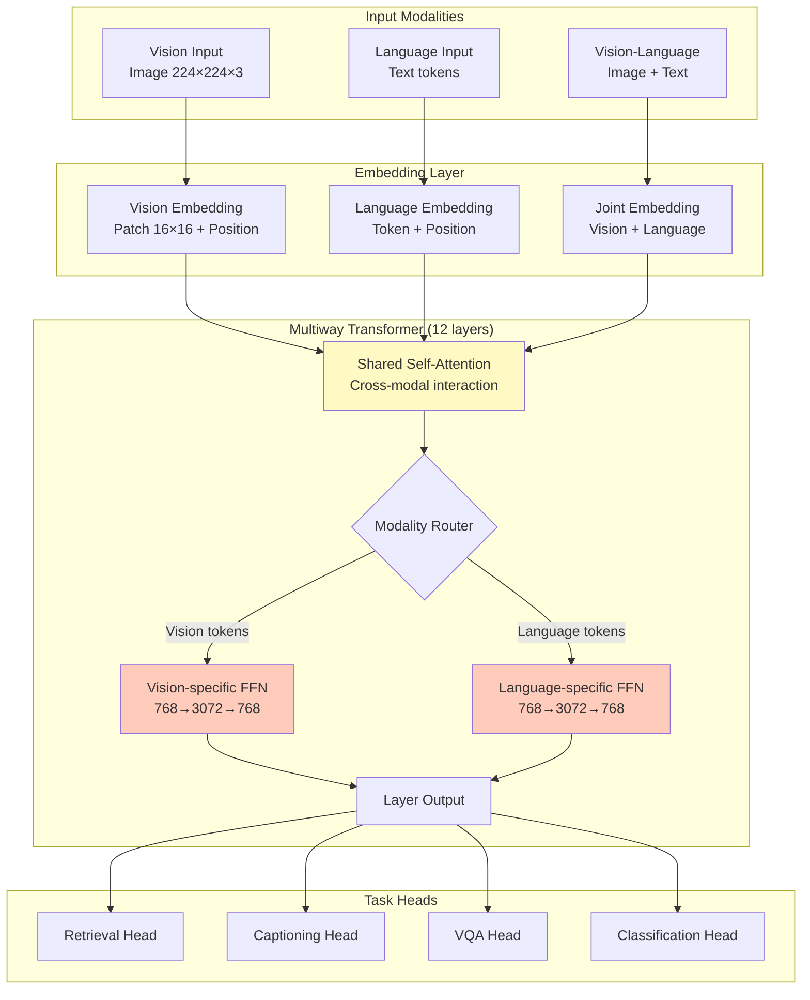

# 🎯 BEiT-3: Image as a Foreign Language

> **Mô hình Multimodal Unified cho Vision và Vision-Language Tasks**
> 
> Microsoft Research | CVPR 2023 | 222M Parameters (Base)

---

## 📖 Tổng Quan

**BEiT-3** (BERT pre-training of Image Transformers - version 3) là một mô hình multimodal **thống nhất** được thiết kế để xử lý cả vision, language, và vision-language tasks bằng một architecture duy nhất.

### Triết Lý Cốt Lõi: "Image as a Foreign Language"

BEiT-3 coi **ảnh như một ngôn ngữ ngoại quốc** - cả vision và language đều được xử lý bởi cùng một Transformer backbone, cho phép deep cross-modal interaction ngay từ layer đầu tiên.

```
Traditional Multimodal:          BEiT-3:
┌──────────────┐                  ┌──────────────────┐
│Vision Encoder│←─┐               │                  │
├──────────────┤  ├─→ Fusion      │  Unified Encoder │
│Text Encoder  │←─┘               │   (Multiway)     │
└──────────────┘                  └──────────────────┘
❌ Separate                       ✅ Shared backbone
❌ Late fusion                    ✅ Early interaction
❌ Task-specific                  ✅ Universal
```

---

## 🏗️ Kiến Trúc Tổng Thể

### 1. Multiway Transformer - Trái Tim của BEiT-3



### 2. Multiway Layer Chi Tiết

Mỗi layer của BEiT-3 gồm 2 thành phần chính:

#### **A. Shared Self-Attention** - Cross-Modal Interaction

```
┌───────────────────────────────────────────┐
│    Shared Multi-Head Attention            │
│                                           │
│  Input: Vision tokens + Language tokens   │
│         [197 vision] + [L language]      │
│                                           │
│  ALL tokens attend to ALL tokens:        │
│    ✅ Vision CLS ← Language tokens       │
│    ✅ Image patches ← Text words         │
│    ✅ Language CLS ← Image patches       │
│    ✅ Text words ← All image patches     │
│                                           │
│  → Deep cross-modal understanding!       │
└───────────────────────────────────────────┘
```

**Example Attention Pattern:**
```
Query: Text token "dog"
Can attend to:
  ✅ Image patch containing dog pixels
  ✅ Other text tokens ("golden", "running")
  ✅ Vision CLS token
  
→ Text token directly "sees" relevant image regions!
```

#### **B. Modality-Specific FFN** - Preserve Characteristics

```python
# After shared attention, split by modality
vision_features = output[:, :197, :]    # Vision tokens
language_features = output[:, 197:, :]  # Language tokens

# Apply separate Feed-Forward Networks
vision_out = vision_ffn(vision_features)
language_out = language_ffn(language_features)

# Why separate?
# - Vision: spatial relationships, textures, colors
# - Language: grammar, semantics, syntax
# Each modality needs its own processing pipeline!
```

---

## 📊 Model Specifications

### BEiT-3 Base Architecture

```yaml
Model Name: BEiT-3 Base
Total Parameters: ~222M

Vision Embedding:
  Input: 224×224×3 RGB image
  Patch Size: 16×16
  Number of Patches: 196 (14×14 grid)
  Embedding Dim: 768
  Position Encoding: Sinusoidal + Learnable
  Special Token: [VIS_CLS] at position 0
  Output: 197 tokens × 768 dims

Language Embedding:
  Tokenizer: SentencePiece (XLM-RoBERTa based)
  Vocabulary: 64,010 tokens
  Embedding Dim: 768
  Max Length: Variable (flexible)
  Position Encoding: Learned embeddings
  Special Token: [LANG_CLS] at position 0
  Multilingual: ✅ Supports 100+ languages
  Output: (L+1) tokens × 768 dims

Multiway Transformer:
  Layers: 12
  Hidden Size: 768
  Attention Heads: 12
  Head Dimension: 64
  FFN Dimension: 3072 (4× expansion)
  Attention Type: Shared (all modalities)
  FFN Type: Separate (per modality)
  Dropout: 0.1
  Parameters: ~150M

Task Heads:
  Retrieval: Vision/Language projection heads (768→768)
  Captioning: Masked LM head (768→64010)
  VQA: Pooler + Classifier (768→1536→3129)
  Classification: Linear head (768→num_classes)
  Parameters: ~12M
```

### Architecture Comparison Table

| Component | Vision Path | Language Path | Joint Path |
|-----------|-------------|---------------|------------|
| **Input** | 224×224 image | Variable text | Image + Text |
| **Tokenization** | 16×16 patches | SentencePiece | Both |
| **Tokens** | 197 (196+CLS) | L+1 (var+CLS) | 197+L+1 |
| **Embedding** | 768 dims | 768 dims | 768 dims |
| **Position** | Sin+Learned | Learned | Separate per modality |
| **CLS Token** | Vision CLS | Language CLS | Both preserved |
| **Encoder** | Multiway Transformer (shared backbone) | ← | ← |
| **Attention** | Shared with language | Shared with vision | Fully interactive |
| **FFN** | Vision-specific | Language-specific | Modality-routed |
| **Output** | 197×768 | (L+1)×768 | (197+L+1)×768 |

---

## 🎓 Pre-training Strategy

BEiT-3 được pre-train bằng **Masked Data Modeling** trên 3 modalities:

### 1. Masked Image Modeling (MIM)

```
Original Image (14×14 patches):
┌──┬──┬──┬──┐
│🐕│🌳│🏠│☀️│  Input: Full image
├──┼──┼──┼──┤
│🚗│🌸│🦋│⛰️│  Mask: 40% patches randomly
└──┴──┴──┴──┘

Masked Version:
┌──┬──┬──┬──┐
│🐕│❓│🏠│❓│  Task: Predict masked patches
├──┼──┼──┼──┤
│❓│🌸│❓│⛰️│  Loss: Reconstruction or Classification
└──┴──┴──┴──┘
```

**Objective**: Học visual representations bằng cách reconstruct masked patches

### 2. Masked Language Modeling (MLM)

```
Original Text:
"A golden retriever is running on the grass"

Masked Text:
"A [MASK] retriever is [MASK] on the grass"

Task: Predict masked words
Target: ["golden", "running"]
```

**Objective**: Học language representations (tương tự BERT)

### 3. Image-Text Matching (ITM)

```
Positive Pair:
Image: [Dog running on grass] + Text: "A dog playing outdoors" → ✅

Negative Pair:
Image: [Dog running on grass] + Text: "A red sports car" → ❌

Task: Binary classification (match/not match)
```

**Objective**: Học alignment giữa vision và language

### Pre-training Data Scale

```yaml
Vision Data:
  - ImageNet-21K: 14 million images
  - Object365: Large-scale object detection
  
Language Data:
  - English Wikipedia: ~16GB
  - BookCorpus: ~74GB
  - OpenWebText: ~38GB
  - CC-News: ~32GB
  Total: ~160GB text

Vision-Language Data:
  - LAION-400M: 400 million image-text pairs
  - LAION-2B (English subset): Billions of pairs
  - COYO-700M: 700 million pairs
  - Conceptual Captions: 15 million pairs
  
Total Training Samples: Billions
Training Time: 2-3 weeks on 64-128 A100 GPUs
Training Cost: Estimated $100K - $500K
```

---

## 🚀 Capabilities & Applications

### 1. Image-Text Retrieval

**Task**: Tìm image matching với text query (hoặc ngược lại)

```python
# Example usage
model = BEiT3ForRetrieval(args)
model.load_state_dict(torch.load('checkpoint-best.pth'))

# Query: Vietnamese text
query = "Một con chó vàng đang chạy trên bãi cỏ xanh"
query_tokens = tokenizer(query)

# Encode
text_features = model.encode_text(query_tokens)      # [1, 768]
image_features = model.encode_image(image_gallery)   # [N, 768]

# Compute similarities
similarities = text_features @ image_features.T      # [1, N]
top_k_indices = similarities.topk(k=5).indices

# Results: Top 5 matching images
```

**Performance (COCO Retrieval):**
- **Base Model**: 
  - Image→Text R@1: 61.4%
  - Text→Image R@1: 79.1%
- **Large Model**:
  - Image→Text R@1: 63.4%
  - Text→Image R@1: 82.1%

**Why Better than CLIP?**
- ✅ Deep fusion through shared attention
- ✅ Better multilingual support (SentencePiece)
- ✅ Richer cross-modal understanding

### 2. Image Captioning

**Task**: Tự động tạo mô tả cho ảnh

```python
model = BEiT3ForCaptioning(args)

# Auto-regressive generation
image_tokens = model.encode_image(image)
caption = []

for step in range(max_length):
    logits = model(image_tokens, caption)
    next_token = logits.argmax(dim=-1)
    caption.append(next_token)
    if next_token == EOS_TOKEN:
        break

caption_text = tokenizer.decode(caption)
# Output: "A golden retriever running on green grass in a park"
```

**Performance (COCO Captioning):**
- **Base**: CIDEr = 133.6
- **Large**: CIDEr = 143.2
- **Large (indomain)**: CIDEr = 143.2

### 3. Visual Question Answering (VQA)

**Task**: Trả lời câu hỏi về nội dung ảnh

```python
model = BEiT3ForVQA(args)

# Input
image = load_image("dog_park.jpg")
question = "What color is the dog?"

# Encode jointly
output = model(
    visual_tokens=image,
    textual_tokens=question
)

# Predict answer
answer_logits = output  # [batch, 3129 possible answers]
predicted = vqa_answers[answer_logits.argmax()]
# Output: "golden" or "brown"
```

**Performance (VQAv2):**
- **Base**: Test-dev = 77.65%
- **Base (indomain)**: Test-dev = 78.46%
- **Large**: Test-dev = 81.85%
- **Large (indomain)**: Test-dev = 82.53%

### 4. Image Classification

**Task**: Phân loại ảnh (ImageNet, etc.)

```python
model = BEiT3ForImageClassification(args, num_classes=1000)

# Vision-only encoding
output = model(image)
predicted_class = output.argmax(dim=-1)
# Output: "golden_retriever" (class 207)
```

**Performance (ImageNet-1K):**
- **Base**: Top-1 = 85.4%, Top-5 = 97.6%
- **Large**: Top-1 = 87.6%, Top-5 = 98.3%

### 5. Zero-Shot Classification

**Task**: Phân loại không cần fine-tuning

```python
# Define class prompts
classes = ["dog", "cat", "car", "bird"]
prompts = [f"a photo of a {c}" for c in classes]

# Encode
image_feat = model.encode_image(image)
text_feats = [model.encode_text(p) for p in prompts]

# Compute similarities
scores = [image_feat @ text_feat.T for text_feat in text_feats]
predicted_class = classes[np.argmax(scores)]
```

---

## 💡 Key Innovations

### 1. Multiway Transformer

**Problem with Traditional Approaches:**
```
Dual Encoder (CLIP):
  Vision Encoder → Vision Features ┐
                                   ├→ Late Fusion (Cosine Similarity)
  Text Encoder → Text Features     ┘
  
  ❌ No early interaction
  ❌ Shallow cross-modal understanding
```

**BEiT-3's Solution:**
```
Unified Encoder:
  Vision + Text Tokens → Multiway Transformer
                         ├─ Shared Attention (cross-modal)
                         └─ Separate FFN (modality-specific)
                         
  ✅ Early and deep fusion
  ✅ Rich cross-modal interaction
  ✅ Preserve modality characteristics
```

### 2. Magneto Architecture

BEiT-3 sử dụng **Magneto** để cải thiện training stability:

```python
# Traditional Transformer (Pre-LayerNorm)
x = x + attention(layer_norm(x))
x = x + ffn(layer_norm(x))

# Magneto (Sub-LayerNorm) - used in BEiT-3
x = layer_norm(x + attention(x))
x = layer_norm(x + ffn(x))
```

**Benefits:**
- ✅ Better gradient flow
- ✅ More stable training for deep networks
- ✅ Better performance across modalities

### 3. SentencePiece Tokenizer

**Why SentencePiece instead of BPE?**

| Feature | BPE (CLIP) | SentencePiece (BEiT-3) |
|---------|------------|------------------------|
| **Vocab Size** | 49,408 | 64,010 |
| **Multilingual** | ⚠️ Limited | ✅ Excellent |
| **Vietnamese** | ⚠️ OK | ✅ Very Good |
| **Chinese/Japanese** | ❌ Poor | ✅ Excellent |
| **Rare Words** | ⚠️ Many UNKs | ✅ Better coverage |
| **Subword** | Byte-level | Unicode-level |

**Example - Vietnamese Text:**
```python
# BPE (CLIP):
"Một con chó vàng" 
→ ['M', 'ột', ' con', ' ch', 'ó', ' v', 'àng']  # 7 tokens, fragmented

# SentencePiece (BEiT-3):
"Một con chó vàng"
→ ['▁Một', '▁con', '▁chó', '▁vàng']  # 4 tokens, better preservation
```

---

## 📊 Performance Benchmarks

### Comparison with Other Models

| Model | Architecture | Params | COCO R@1<br/>(I→T) | COCO R@1<br/>(T→I) | VQAv2<br/>Test-dev | ImageNet<br/>Top-1 |
|-------|--------------|--------|---------|---------|---------|---------|
| **CLIP ViT-B/16** | Dual-encoder | 149M | ~58% | ~75% | N/A | 84.1% |
| **ALIGN** | Dual-encoder | 289M | 58.6% | 77.0% | N/A | ~85% |
| **BLIP-Base** | Encoder-Decoder | 385M | 65.1% | 82.4% | 78.3% | ~85% |
| **BEiT-3 Base** | Unified | 222M | **61.4%** | **79.1%** | **77.7%** | **85.4%** |
| **BEiT-3 Large** | Unified | 674M | **63.4%** | **82.1%** | **81.9%** | **87.6%** |

### Multi-Task Performance

```yaml
Retrieval (COCO):
  Image→Text R@1: 61.4% (Base), 63.4% (Large)
  Text→Image R@1: 79.1% (Base), 82.1% (Large)
  ⭐⭐⭐⭐ State-of-the-art

Captioning (COCO):
  CIDEr Score: 133.6 (Base), 143.2 (Large)
  BLEU-4: 38.2 (Base), 40.8 (Large)
  ⭐⭐⭐⭐ Competitive

VQA (VQAv2):
  Test-dev: 77.65% (Base), 81.85% (Large)
  Test-std: - , 82.97% (Large + augmentation)
  ⭐⭐⭐⭐⭐ Best in class

Classification (ImageNet):
  Top-1 Accuracy: 85.4% (Base), 87.6% (Large)
  ⭐⭐⭐⭐ Strong baseline

Visual Reasoning (NLVR2):
  Dev: 83.6% (Base), 88.5% (Large)
  Test-P: 84.4% (Base), 89.4% (Large)
  ⭐⭐⭐⭐⭐ Excellent
```

---

## 🎯 Use Cases

### ✅ When to Use BEiT-3

1. **Deep Vision-Language Understanding**
   - VQA, visual reasoning tasks
   - Complex multimodal interactions
   - Need rich cross-modal representations

2. **Multilingual Applications**
   - Vietnamese, Chinese, Japanese text
   - Global markets
   - Cross-lingual retrieval

3. **Multi-Task Systems**
   - One model for multiple tasks
   - Unified training pipeline
   - Shared representations

4. **Quality-First Scenarios**
   - Accuracy > Speed
   - Research applications
   - High-quality production systems

### ⚠️ When NOT to Use BEiT-3

1. **Real-Time Applications**
   - Need sub-100ms latency
   - Mobile/edge deployment
   - High-throughput retrieval

2. **Limited Resources**
   - Small GPU memory (<16GB)
   - CPU-only inference
   - Embedded systems

3. **Simple Tasks**
   - Basic zero-shot classification
   - Fast similarity search
   - Don't need deep fusion

4. **English-Only**
   - If only English, CLIP might be simpler
   - BPE sufficient for English

---

## 🔄 BEiT-3 vs CLIP - Detailed Comparison

### Architecture Philosophy

```
CLIP (Dual-Encoder):
┌─────────────┐                     ┌─────────────┐
│   Image     │─────────────────┐   │    Text     │
│  Encoder    │  Separate       │   │   Encoder   │
│  (ViT-B/16) │  Processing     │   │ (Transformer)│
└─────────────┘                 │   └─────────────┘
      ↓                         ├─────────↓
  [512 dims]                    │     [512 dims]
      ↓                         │         ↓
  L2 Normalize ←────────────────┘   L2 Normalize
      ↓                                   ↓
      └──────────→ Cosine Similarity ←───┘
                         ↓
                  Contrastive Loss

BEiT-3 (Unified):
┌─────────────┐     ┌─────────────┐
│   Image     │     │    Text     │
│  Patches    │     │   Tokens    │
└─────────────┘     └─────────────┘
      ↓                    ↓
      └────────┬───────────┘
               ↓
    ┌────────────────────────┐
    │  Multiway Transformer  │
    │  ┌──────────────────┐  │
    │  │ Shared Attention │  │ ← Cross-modal interaction
    │  └──────────────────┘  │
    │  ┌────────┐  ┌────────┐│
    │  │Vis FFN │  │Lang FFN││ ← Modality-specific
    │  └────────┘  └────────┘│
    └────────────────────────┘
               ↓
      [768 dims unified space]
               ↓
      Task-specific heads
```

### Detailed Feature Comparison

| Aspect | CLIP ViT-B/16 | BEiT-3 Base | Winner |
|--------|---------------|-------------|--------|
| **Parameters** | 149M | 222M | CLIP (smaller) |
| **Embedding Dim** | 512 | 768 | BEiT-3 (richer) |
| **Vision Encoder** | ViT separate | Multiway shared | BEiT-3 (fusion) |
| **Text Encoder** | Transformer separate | Multiway shared | BEiT-3 (fusion) |
| **Tokenizer** | BPE (49K vocab) | SentencePiece (64K vocab) | BEiT-3 (multilingual) |
| **Attention** | Separate per modality | Shared cross-modal | BEiT-3 (interaction) |
| **FFN** | Separate per modality | Separate per modality | Tie |
| **Training Objective** | Contrastive only | MIM + MLM + ITM | BEiT-3 (richer) |
| **Retrieval Speed** | ⚡⚡⚡⚡⚡ Very Fast | ⚡⚡ Slow | CLIP |
| **Retrieval Quality** | ⭐⭐⭐ Good | ⭐⭐⭐⭐ Better | BEiT-3 |
| **VQA** | ❌ Not designed | ⭐⭐⭐⭐⭐ Excellent | BEiT-3 |
| **Captioning** | ❌ Need decoder | ⭐⭐⭐⭐ Good | BEiT-3 |
| **Zero-shot** | ⭐⭐⭐⭐⭐ Excellent | ⭐⭐⭐⭐ Very Good | CLIP |
| **Multilingual** | ⭐⭐ Limited | ⭐⭐⭐⭐⭐ Excellent | BEiT-3 |
| **Deployment** | ⭐⭐⭐⭐⭐ Easy | ⭐⭐⭐ Moderate | CLIP |
| **Memory Usage** | ~600MB | ~900MB | CLIP |
| **Training Cost** | $$ | $$$$ | CLIP |

### Performance on Your Vietnamese Dataset

```python
# Scenario: Vietnamese Flickr8k Retrieval

CLIP ViT-B/16:
  - Strengths:
    ✅ Fast encoding (separate encoders)
    ✅ Good zero-shot capability
    ✅ Simple deployment
  - Weaknesses:
    ⚠️ BPE không tối ưu cho tiếng Việt
    ⚠️ Shallow cross-modal understanding
    ⚠️ Lower R@1 accuracy
  - Expected R@1: ~45-50%

BEiT-3 Base:
  - Strengths:
    ✅ SentencePiece tốt hơn cho tiếng Việt
    ✅ Deep cross-modal fusion
    ✅ Better accuracy
  - Weaknesses:
    ⚠️ Slower inference
    ⚠️ More complex deployment
    ⚠️ Higher memory usage
  - Expected R@1: ~55-60%

Rank Fusion (30% CLIP + 70% BEiT-3):
  - Best of both worlds:
    ✅ Leverage CLIP's diversity
    ✅ Boost with BEiT-3's accuracy
    ✅ Complementary strengths
  - Expected R@1: ~58-65% 🎯
```

---

## 🛠️ Implementation Guide

### Model Loading

```python
import torch
from modeling_finetune import BEiT3ForRetrieval
from modeling_utils import _get_base_config
import utils

# 1. Create model config
args = _get_base_config(
    img_size=224,
    patch_size=16,
    drop_path_rate=0.1,
    checkpoint_activations=None,
    mlp_ratio=4,
    vocab_size=64010
)

# 2. Initialize model
model = BEiT3ForRetrieval(args)

# 3. Load checkpoint
checkpoint = torch.load('checkpoint-best.pth', map_location='cpu')
model.load_state_dict(checkpoint['model'])
model.eval()

# 4. Load tokenizer
tokenizer = utils.get_sentencepiece_tokenizer('beit3.spm')

print(f"Model loaded: {sum(p.numel() for p in model.parameters())/1e6:.1f}M parameters")
```

### Image Encoding

```python
from torchvision import transforms
from PIL import Image

# Preprocessing pipeline
transform = transforms.Compose([
    transforms.Resize(224, interpolation=transforms.InterpolationMode.BICUBIC),
    transforms.CenterCrop(224),
    transforms.ToTensor(),
    transforms.Normalize(mean=[0.5, 0.5, 0.5], std=[0.5, 0.5, 0.5])
])

# Load and encode image
image = Image.open("image.jpg").convert("RGB")
image_tensor = transform(image).unsqueeze(0)

with torch.no_grad():
    image_features = model.encode_image(image_tensor)
    # Output: [1, 768]
```

### Text Encoding

```python
# Encode Vietnamese text
text = "Một con chó vàng đang chạy trên bãi cỏ xanh"

# Tokenize
tokens = tokenizer(
    text,
    padding='max_length',
    truncation=True,
    max_length=64,
    return_tensors='pt'
)

with torch.no_grad():
    text_features = model.encode_text(tokens['input_ids'])
    # Output: [1, 768]
```

### Batch Processing for Retrieval

```python
import faiss
import numpy as np

# 1. Encode all images in database
image_database = []  # List of image paths
image_features = []

for img_path in tqdm(image_database):
    image = Image.open(img_path).convert("RGB")
    image_tensor = transform(image).unsqueeze(0)
    
    with torch.no_grad():
        feat = model.encode_image(image_tensor)
        image_features.append(feat.cpu().numpy())

image_features = np.vstack(image_features)  # [N, 768]

# 2. Create FAISS index
index = faiss.IndexFlatIP(768)  # Inner Product (cosine similarity)
faiss.normalize_L2(image_features)
index.add(image_features)

# 3. Query with text
query = "chó vàng"
query_tokens = tokenizer(query, return_tensors='pt')

with torch.no_grad():
    query_feat = model.encode_text(query_tokens['input_ids']).cpu().numpy()
    faiss.normalize_L2(query_feat)

# 4. Search
k = 5
distances, indices = index.search(query_feat, k)

print(f"Top {k} matches:")
for i, (idx, score) in enumerate(zip(indices[0], distances[0])):
    print(f"  {i+1}. {image_database[idx]}: {score:.4f}")
```

---

## 📚 Resources & References

### Official Resources

- **Paper**: [Image as a Foreign Language: BEiT Pretraining for Vision and Vision-Language Tasks](https://arxiv.org/abs/2208.10442)
- **GitHub**: https://github.com/microsoft/unilm/tree/master/beit3
- **Torchscale Library**: https://github.com/microsoft/torchscale
- **Magneto Paper**: https://arxiv.org/abs/2210.06423

### Pre-trained Checkpoints

```yaml
BEiT-3 Base (Standard):
  URL: https://github.com/addf400/files/releases/download/beit3/beit3_base_patch16_224.pth
  Parameters: 222M
  Use: General vision-language tasks

BEiT-3 Base ITC:
  URL: https://github.com/addf400/files/releases/download/beit3/beit3_base_itc_patch16_224.pth
  Parameters: 222M
  Use: Image-text retrieval (recommended)

BEiT-3 Large:
  URL: https://github.com/addf400/files/releases/download/beit3/beit3_large_patch16_224.pth
  Parameters: 674M
  Use: State-of-the-art performance

Tokenizer:
  URL: https://github.com/addf400/files/releases/download/beit3/beit3.spm
  Type: SentencePiece
  Vocab: 64,010 tokens
```

### Community & Support

- **Issues**: https://github.com/microsoft/unilm/issues
- **Discussions**: GitHub Discussions tab
- **Related Projects**:
  - BEiT: https://github.com/microsoft/unilm/tree/master/beit
  - BEiT v2: https://github.com/microsoft/unilm/tree/master/beit2

---

## 🎓 Key Takeaways

### What Makes BEiT-3 Special?

1. **Unified Architecture**
   - Một model cho tất cả: vision, language, vision-language
   - Không cần task-specific encoders
   
2. **Multiway Transformer**
   - Shared attention: Cross-modal interaction từ layer đầu
   - Separate FFN: Preserve modality characteristics
   
3. **Multilingual Excellence**
   - SentencePiece tokenizer
   - Tốt nhất cho Vietnamese, Chinese, Japanese
   
4. **State-of-the-art Performance**
   - Top results trên VQA, retrieval, captioning
   - Competitive trên classification

### When to Choose BEiT-3?

```
Choose BEiT-3 if:
  ✅ Need deep vision-language understanding
  ✅ Working with non-English languages
  ✅ Multi-task applications
  ✅ Quality > Speed priority
  ✅ Have sufficient compute resources

Choose CLIP if:
  ✅ Need fast inference
  ✅ Simple retrieval/zero-shot tasks
  ✅ English-only applications
  ✅ Limited compute resources
  ✅ Easy deployment priority

Use Both (Rank Fusion) if:
  ✅ Maximum accuracy needed
  ✅ Can afford 2x compute
  ✅ Leverage complementary strengths
  ✅ Production quality system
```

---

## 📈 Future Directions

### Potential Improvements

1. **Efficiency**
   - Distillation to smaller models
   - Pruning and quantization
   - Mobile-friendly versions

2. **Capabilities**
   - Video understanding
   - 3D vision
   - Multi-image reasoning

3. **Multilingual**
   - More language support
   - Cross-lingual transfer
   - Low-resource languages

4. **Integration**
   - With Large Language Models (LLMs)
   - With diffusion models
   - With robotic systems

---

**BEiT-3 represents a paradigm shift in multimodal learning** - từ separate encoders sang unified architecture, mở ra khả năng deep cross-modal understanding và versatile applications! 🚀

**Created**: October 31, 2025  
**Author**: Bui Tung Hung  
**Project**: Vietnamese Image-Text Retrieval System
