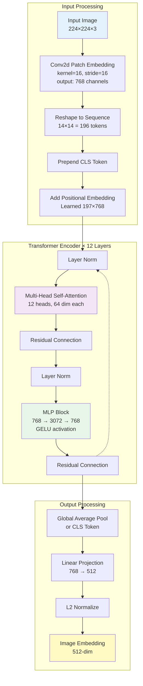
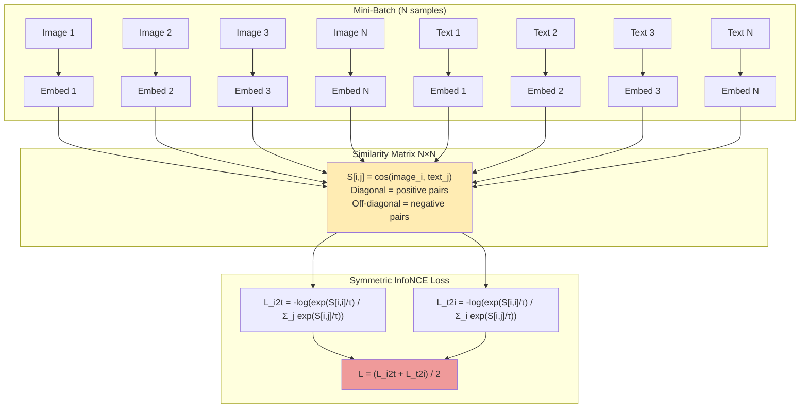
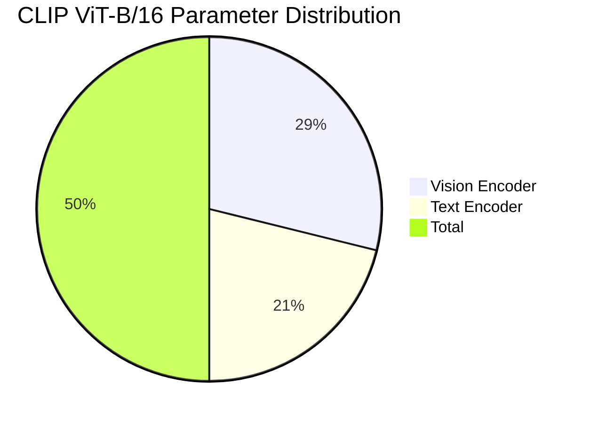
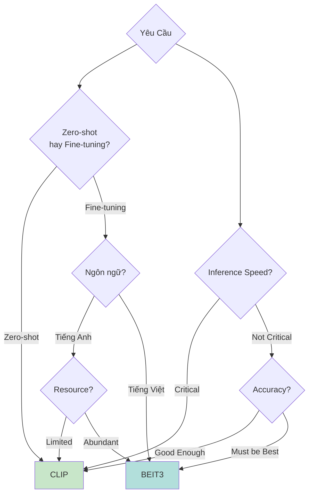

# CLIP (Contrastive Language-Image Pre-training) - Kiến Trúc và Hướng Dẫn Chi Tiết

## Mục Lục
1. [Giới Thiệu Tổng Quan](#1-giới-thiệu-tổng-quan)
2. [Kiến Trúc CLIP](#2-kiến-trúc-clip)
3. [Vision Transformer (ViT-B/16)](#3-vision-transformer-vit-b16)
4. [Text Encoder](#4-text-encoder)
5. [Contrastive Learning](#5-contrastive-learning)
6. [Tokenizer và Xử Lý Văn Bản](#6-tokenizer-và-xử-lý-văn-bản)
7. [Thông Số Kỹ Thuật](#7-thông-số-kỹ-thuật)
8. [Khả Năng và Ứng Dụng](#8-khả-năng-và-ứng-dụng)
9. [Triển Khai Thực Tế](#9-triển-khai-thực-tế)
10. [So Sánh với BEiT3](#10-so-sánh-với-beit3)
11. [Tài Nguyên và Tham Khảo](#11-tài-nguyên-và-tham-khảo)

---

## 1. Giới Thiệu Tổng Quan

### 1.1. CLIP là gì?

**CLIP (Contrastive Language-Image Pre-training)** là mô hình đa phương thức (multimodal) được phát triển bởi OpenAI, có khả năng hiểu đồng thời cả hình ảnh và văn bản thông qua việc học biểu diễn chung (joint representation).

### 1.2. Triết Lý Thiết Kế


**Ý tưởng cốt lõi:**
- **Learning from Natural Language**: Học từ mô tả tự nhiên thay vì nhãn phân loại cứng nhắc
- **Zero-Shot Transfer**: Khả năng thực hiện tác vụ mới mà không cần fine-tuning
- **Scalability**: Huấn luyện trên 400 triệu cặp (ảnh, text) từ Internet

### 1.3. Đột Phá Chính

| Đặc Điểm | Mô Hình Truyền Thống | CLIP |
|----------|---------------------|------|
| **Supervision** | ImageNet labels (1000 classes) | Natural language (unlimited concepts) |
| **Transfer Learning** | Requires fine-tuning | Zero-shot capable |
| **Training Data** | Curated datasets (~1M images) | Web-scale data (400M pairs) |
| **Flexibility** | Fixed classes | Open vocabulary |

---

## 2. Kiến Trúc CLIP

### 2.1. Dual-Encoder Architecture

```mermaid
graph TB
    subgraph Input["📥 Input Layer"]
        IMG[Image<br/>224×224×3]
        TXT[Text<br/>"A photo of a cat"]
    end
    
    subgraph VisionEncoder["🖼️ Vision Encoder"]
        PATCH[Patch Embedding<br/>16×16 patches → 197 tokens]
        CLS_V[CLS Token + Position Embed]
        VIT[Vision Transformer<br/>12 layers, 768 dim]
        POOL_V[Global Pool]
        PROJ_V[Linear Projection<br/>768 → 512]
    end
    
    subgraph TextEncoder["📝 Text Encoder"]
        TOK[BPE Tokenizer<br/>49,408 vocab]
        EMB_T[Token + Position Embed]
        TRANS[Transformer<br/>12 layers, 512 dim]
        POOL_T[Take [EOS] Token]
        PROJ_T[Linear Projection<br/>512 → 512]
    end
    
    subgraph Contrastive["⚡ Contrastive Learning"]
        NORM_V[L2 Normalize<br/>Image Features]
        NORM_T[L2 Normalize<br/>Text Features]
        SIM[Cosine Similarity<br/>Matrix N×N]
        LOSS[InfoNCE Loss]
    end
    
    IMG --> PATCH --> CLS_V --> VIT --> POOL_V --> PROJ_V --> NORM_V
    TXT --> TOK --> EMB_T --> TRANS --> POOL_T --> PROJ_T --> NORM_T
    NORM_V --> SIM
    NORM_T --> SIM
    SIM --> LOSS
    
    style IMG fill:#e3f2fd
    style TXT fill:#fff3e0
    style VIT fill:#e1bee7
    style TRANS fill:#c5e1a5
    style SIM fill:#ffccbc
    style LOSS fill:#ef9a9a
```

### 2.2. Luồng Xử Lý

**Image Path:**
```
Raw Image (224×224×3)
    ↓ Patch Embedding
Patch Tokens (14×14 = 196 patches)
    ↓ Add CLS Token + Positional Encoding
Embedded Tokens (197 tokens × 768 dim)
    ↓ Vision Transformer (12 layers)
Encoded Features (197 tokens × 768 dim)
    ↓ Global Average Pooling
Pooled Features (768 dim)
    ↓ Linear Projection
Final Image Embedding (512 dim)
    ↓ L2 Normalization
Normalized Embedding (512 dim, unit length)
```

**Text Path:**
```
Raw Text ("A photo of a cat")
    ↓ BPE Tokenization
Token IDs [start, 320, 1125, 539, 320, 2368, end, pad...]
    ↓ Token Embedding + Positional Encoding
Embedded Tokens (77 tokens × 512 dim)
    ↓ Transformer with Causal Mask (12 layers)
Encoded Features (77 tokens × 512 dim)
    ↓ Take [EOS] Token
EOS Features (512 dim)
    ↓ Linear Projection
Final Text Embedding (512 dim)
    ↓ L2 Normalization
Normalized Embedding (512 dim, unit length)
```

---

## 3. Vision Transformer (ViT-B/16)

### 3.1. Kiến Trúc Vision Transformer



### 3.2. ResidualAttentionBlock Chi Tiết

```python
class ResidualAttentionBlock(nn.Module):
    def __init__(self, d_model=768, n_head=12, mlp_ratio=4.0):
        super().__init__()
        self.ln_1 = nn.LayerNorm(d_model)
        self.attn = nn.MultiheadAttention(d_model, n_head)
        self.ln_2 = nn.LayerNorm(d_model)
        self.mlp = nn.Sequential(
            nn.Linear(d_model, int(d_model * mlp_ratio)),  # 768 → 3072
            nn.GELU(),
            nn.Linear(int(d_model * mlp_ratio), d_model),  # 3072 → 768
        )
    
    def forward(self, x):
        # Multi-Head Self-Attention với residual
        x = x + self.attn(self.ln_1(x), self.ln_1(x), self.ln_1(x))[0]
        # MLP với residual
        x = x + self.mlp(self.ln_2(x))
        return x
```

### 3.3. Thông Số Chi Tiết ViT-B/16

| Thành Phần | Giá Trị | Mô Tả |
|------------|---------|-------|
| **Patch Size** | 16×16 | Kích thước mỗi patch |
| **Image Size** | 224×224 | Input resolution |
| **Number of Patches** | 196 (14×14) | Số lượng tokens từ ảnh |
| **Embedding Dim** | 768 | Chiều vector cho mỗi token |
| **Number of Layers** | 12 | Số lớp transformer |
| **Attention Heads** | 12 | Số heads trong MHSA |
| **Head Dimension** | 64 (768/12) | Chiều mỗi attention head |
| **MLP Hidden Dim** | 3072 (768×4) | Chiều ẩn trong MLP |
| **Projection Dim** | 512 | Output embedding dimension |
| **Parameters** | ~86M | Số tham số vision encoder |

---

## 4. Text Encoder

### 4.1. Kiến Trúc Text Transformer

```mermaid
graph TB
    subgraph Input["Text Input Processing"]
        TXT[Text Input<br/>"A photo of a dog"]
        BPE[BPE Tokenizer<br/>49,408 vocabulary]
        IDS[Token IDs<br/>[49406, 320, 1125, ..., 49407]]
        PAD[Pad to 77 tokens]
        EMB[Token Embedding<br/>49408 × 512]
        POS[Positional Embedding<br/>77 × 512]
        ADD[Add Embeddings]
    end
    
    subgraph Encoder["Transformer Encoder × 12 Layers"]
        direction TB
        LN1[Layer Norm]
        MHSA[Causal Multi-Head<br/>Self-Attention<br/>8 heads, 64 dim each]
        RES1[Residual Connection]
        LN2[Layer Norm]
        MLP[MLP Block<br/>512 → 2048 → 512<br/>QuickGELU]
        RES2[Residual Connection]
    end
    
    subgraph Output["Output Processing"]
        EOS[Extract [EOS] Token<br/>Last non-padded position]
        LN_F[Final Layer Norm]
        PROJ[Text Projection<br/>512 → 512]
        NORM[L2 Normalize]
        OUT[Text Embedding<br/>512-dim]
    end
    
    TXT --> BPE --> IDS --> PAD --> EMB
    POS --> ADD
    EMB --> ADD
    ADD --> LN1 --> MHSA --> RES1
    RES1 --> LN2 --> MLP --> RES2
    RES2 -.-> LN1
    RES2 --> EOS --> LN_F --> PROJ --> NORM --> OUT
    
    style TXT fill:#fff3e0
    style MHSA fill:#e1bee7
    style MLP fill:#c5e1a5
    style OUT fill:#fff9c4
```

### 4.2. Causal Attention Mask

**Tại sao Text Encoder sử dụng Causal Mask?**


Mặc dù CLIP là mô hình **understanding** (không phải generation), việc sử dụng causal mask giúp:
- **Tính nhất quán**: Sử dụng kiến trúc GPT đã được chứng minh hiệu quả
- **Transfer learning**: Có thể khởi tạo từ GPT pre-trained weights
- **Regularization**: Ngăn chặn overfitting bằng cách hạn chế thông tin

```python
# Causal Mask cho Text Transformer
def build_attention_mask(context_length=77):
    # Tạo upper triangular matrix
    mask = torch.empty(context_length, context_length)
    mask.fill_(float("-inf"))
    mask.triu_(1)  # Zero out diagonal và lower triangle
    return mask

# Trong forward pass:
# attn_mask shape: [77, 77]
# [[  0, -inf, -inf, ..., -inf],
#  [  0,   0, -inf, ..., -inf],
#  [  0,   0,   0, ..., -inf],
#  ...
#  [  0,   0,   0, ...,   0]]
```

### 4.3. Text Transformer Implementation

```python
class TextTransformer(nn.Module):
    def __init__(
        self,
        context_length=77,
        vocab_size=49408,
        width=512,
        heads=8,
        layers=12,
    ):
        super().__init__()
        self.context_length = context_length
        self.vocab_size = vocab_size
        
        # Token và Positional Embeddings
        self.token_embedding = nn.Embedding(vocab_size, width)
        self.positional_embedding = nn.Parameter(torch.empty(context_length, width))
        
        # Transformer Layers
        self.transformer = nn.ModuleList([
            ResidualAttentionBlock(width, heads, causal_mask=True)
            for _ in range(layers)
        ])
        
        # Output
        self.ln_final = nn.LayerNorm(width)
        self.text_projection = nn.Parameter(torch.empty(width, width))
        
        self.register_buffer('attn_mask', self.build_attention_mask())
    
    def forward(self, text):
        # text shape: [batch_size, context_length]
        x = self.token_embedding(text)  # [B, 77, 512]
        x = x + self.positional_embedding  # [B, 77, 512]
        x = x.permute(1, 0, 2)  # [77, B, 512] cho nn.MultiheadAttention
        
        # Apply transformer layers
        for block in self.transformer:
            x = block(x, attn_mask=self.attn_mask)
        
        x = x.permute(1, 0, 2)  # [B, 77, 512]
        x = self.ln_final(x)
        
        # Lấy features tại vị trí [EOS] token
        # text.argmax(dim=-1) tìm vị trí token cuối cùng (EOS)
        x = x[torch.arange(x.shape[0]), text.argmax(dim=-1)]
        
        # Project to embedding space
        if self.text_projection is not None:
            x = x @ self.text_projection  # [B, 512]
        
        return x
```

### 4.4. Thông Số Chi Tiết Text Encoder

| Thành Phần | Giá Trị | Mô Tả |
|------------|---------|-------|
| **Context Length** | 77 | Độ dài tối đa của text |
| **Vocabulary Size** | 49,408 | Số tokens trong BPE vocab |
| **Embedding Dim** | 512 | Chiều vector cho mỗi token |
| **Number of Layers** | 12 | Số lớp transformer |
| **Attention Heads** | 8 | Số heads trong MHSA |
| **Head Dimension** | 64 (512/8) | Chiều mỗi attention head |
| **MLP Hidden Dim** | 2048 (512×4) | Chiều ẩn trong MLP |
| **Attention Type** | Causal | GPT-style masking |
| **Parameters** | ~63M | Số tham số text encoder |

---

## 5. Contrastive Learning

### 5.1. InfoNCE Loss



### 5.2. Contrastive Loss Implementation

```python
class CLIP(nn.Module):
    def forward(self, image, text):
        # Encode image và text
        image_features = self.encode_image(image)  # [N, 512]
        text_features = self.encode_text(text)      # [N, 512]
        
        # Normalize features
        image_features = F.normalize(image_features, dim=-1)
        text_features = F.normalize(text_features, dim=-1)
        
        # Learnable temperature parameter
        logit_scale = self.logit_scale.exp()  # Khởi tạo = log(1/0.07)
        
        # Compute cosine similarity matrix
        logits_per_image = logit_scale * image_features @ text_features.T  # [N, N]
        logits_per_text = logits_per_image.T  # [N, N]
        
        # Ground truth: diagonal matrix (i-th image matches i-th text)
        labels = torch.arange(len(image), device=image.device)
        
        # Symmetric cross-entropy loss
        loss_i2t = F.cross_entropy(logits_per_image, labels)
        loss_t2i = F.cross_entropy(logits_per_text, labels)
        loss = (loss_i2t + loss_t2i) / 2
        
        return loss, logits_per_image, logits_per_text
```

### 5.3. Temperature Scaling

**Vai trò của Temperature (τ):**


- **τ nhỏ** (e.g., 0.07): Phân phối xác suất rất "sharp", tập trung vào hard negatives
- **τ lớn**: Phân phối "smoother", tất cả negatives đều có trọng số
- CLIP học τ như một tham số (initialized as `log(1/0.07) ≈ 2.66`)

```python
# Temperature parameter
self.logit_scale = nn.Parameter(torch.ones([]) * np.log(1 / 0.07))

# Trong training:
temperature = self.logit_scale.exp()  # ~14.3 ban đầu
print(f"Current temperature: {1/temperature:.4f}")  # ~0.07
```

---

## 6. Tokenizer và Xử Lý Văn Bản

### 6.1. BPE (Byte Pair Encoding) Tokenizer


**Đặc điểm BPE trong CLIP:**

| Thuộc Tính | Giá Trị | Ý Nghĩa |
|------------|---------|---------|
| **Vocabulary Size** | 49,408 | Số subword units |
| **Training Data** | Web text | Dữ liệu đa dạng từ Internet |
| **Context Length** | 77 tokens | Độ dài tối đa |
| **Special Tokens** | `[SOS]`, `[EOS]`, `[PAD]` | Start, End, Padding |
| **Case Sensitive** | No | Lowercase tất cả |
| **File** | `bpe_simple_vocab_16e6.txt.gz` | Vocabulary file |

### 6.2. Tokenization Process

```python
import gzip
import html
import ftfy
import regex as re

class SimpleTokenizer:
    def __init__(self, bpe_path="bpe_simple_vocab_16e6.txt.gz"):
        # Load BPE vocabulary
        with gzip.open(bpe_path) as f:
            bpe_data = f.read().decode("utf-8")
        
        merges = bpe_data.split('\n')[1:49152-256-2+1]
        merges = [tuple(merge.split()) for merge in merges]
        
        vocab = list(bytes_to_unicode().values())
        vocab += [v+'</w>' for v in vocab]
        for merge in merges:
            vocab.append(''.join(merge))
        
        vocab.extend(['<|startoftext|>', '<|endoftext|>'])
        
        self.encoder = {v: i for i, v in enumerate(vocab)}
        self.decoder = {i: v for i, v in enumerate(vocab)}
        self.bpe_ranks = {merge: i for i, merge in enumerate(merges)}
    
    def encode(self, text):
        # Basic cleanup
        text = ftfy.fix_text(text)
        text = html.unescape(html.unescape(text))
        
        # Apply BPE
        bpe_tokens = []
        for token in re.findall(self.pat, text.lower()):
            token = ''.join(self.byte_encoder[b] for b in token.encode('utf-8'))
            bpe_tokens.extend(self.encoder[bpe_token] for bpe_token in self.bpe(token).split(' '))
        
        return bpe_tokens
    
    def decode(self, tokens):
        text = ''.join([self.decoder[token] for token in tokens])
        text = bytearray([self.byte_decoder[c] for c in text]).decode('utf-8', errors="replace")
        return text

# Sử dụng tokenizer
def tokenize(texts, context_length=77):
    """
    Tokenize texts và pad/truncate về context_length
    """
    sot_token = tokenizer.encoder["<|startoftext|>"]
    eot_token = tokenizer.encoder["<|endoftext|>"]
    
    all_tokens = []
    for text in texts:
        tokens = [sot_token] + tokenizer.encode(text) + [eot_token]
        result = torch.zeros(context_length, dtype=torch.long)
        result[:len(tokens)] = torch.tensor(tokens)
        all_tokens.append(result)
    
    return torch.stack(all_tokens)
```

### 6.3. Ví Dụ Tokenization

```python
# Ví dụ tokenize tiếng Anh
text = "A photo of a cat"
tokens = tokenize([text])
print(f"Text: {text}")
print(f"Token IDs: {tokens[0][:10]}")  # [49406, 320, 1125, 539, 320, 2368, 49407, 0, 0, 0]
print(f"Tokens: {[tokenizer.decoder[t.item()] for t in tokens[0][:7]]}")
# ['<|startoftext|>', 'a', 'photo', 'of', 'a', 'cat', '<|endoftext|>']

# Ví dụ tokenize tiếng Việt (BPE không tối ưu cho tiếng Việt!)
text_vi = "Một con mèo đang ngủ"
tokens_vi = tokenize([text_vi])
print(f"Vietnamese text: {text_vi}")
print(f"Number of tokens: {(tokens_vi[0] != 0).sum()}")  # Thường nhiều hơn tiếng Anh
```

**Lưu ý về tiếng Việt:**
- BPE tokenizer của CLIP **không tối ưu** cho tiếng Việt
- Các từ tiếng Việt có dấu thường bị tách thành nhiều subwords
- Điều này dẫn đến:
  - Nhiều tokens hơn cho cùng một câu
  - Nguy cơ truncation cao hơn (> 77 tokens)
  - Biểu diễn kém hiệu quả hơn

---

## 7. Thông Số Kỹ Thuật

### 7.1. Model Specifications



| Thành Phần | Thông Số |
|------------|----------|
| **Model Name** | ViT-B/16 |
| **Total Parameters** | 149,620,736 (~149M) |
| **Vision Encoder** | 86,192,131 (~86M) |
| **Text Encoder** | 63,428,605 (~63M) |
| **Embedding Dimension** | 512 |
| **Image Resolution** | 224×224 |
| **Patch Size** | 16×16 |
| **Vision Layers** | 12 |
| **Vision Width** | 768 |
| **Vision Heads** | 12 |
| **Text Context Length** | 77 |
| **Text Vocabulary** | 49,408 |
| **Text Layers** | 12 |
| **Text Width** | 512 |
| **Text Heads** | 8 |

### 7.2. Training Configuration

| Thuộc Tính | Giá Trị |
|------------|---------|
| **Training Dataset** | 400M image-text pairs |
| **Data Source** | Internet (filtered) |
| **Batch Size** | 32,768 |
| **Optimizer** | AdamW |
| **Learning Rate** | 5e-4 (with cosine decay) |
| **Weight Decay** | 0.2 |
| **Warmup** | 2,000 steps |
| **Training Steps** | ~1M (32B samples seen) |
| **GPUs** | 256 V100 GPUs |
| **Training Time** | ~12 days |
| **Temperature Init** | log(1/0.07) |

### 7.3. Inference Performance

| Metric | Value |
|--------|-------|
| **FP32 Inference** | ~15ms/image (V100) |
| **FP16 Inference** | ~8ms/image (V100) |
| **Batch Processing** | ~500 images/sec (batch=256) |
| **Text Encoding** | ~1000 texts/sec |
| **VRAM Usage** | ~2GB (FP32) |
| **Model Size** | ~600MB (FP32 weights) |

---

## 8. Khả Năng và Ứng Dụng

### 8.1. Zero-Shot Image Classification

```python
import torch
import open_clip
from PIL import Image

# Load model
model, _, preprocess = open_clip.create_model_and_transforms('ViT-B-16', pretrained='openai')
model.eval()

# Prepare image
image = preprocess(Image.open("cat.jpg")).unsqueeze(0)

# Prepare text prompts
classes = ["a cat", "a dog", "a bird", "a car"]
text_inputs = open_clip.tokenize([f"a photo of {c}" for c in classes])

# Encode
with torch.no_grad():
    image_features = model.encode_image(image)
    text_features = model.encode_text(text_inputs)
    
    # Normalize
    image_features /= image_features.norm(dim=-1, keepdim=True)
    text_features /= text_features.norm(dim=-1, keepdim=True)
    
    # Compute similarity
    similarity = (100.0 * image_features @ text_features.T).softmax(dim=-1)

# Results
for i, class_name in enumerate(classes):
    print(f"{class_name}: {similarity[0, i].item():.2%}")
```

### 8.2. Image-Text Retrieval

```python
import faiss
import numpy as np

# Index images
def build_image_index(image_paths, model, preprocess):
    embeddings = []
    for path in image_paths:
        image = preprocess(Image.open(path)).unsqueeze(0)
        with torch.no_grad():
            features = model.encode_image(image)
            features /= features.norm(dim=-1, keepdim=True)
        embeddings.append(features.cpu().numpy())
    
    embeddings = np.vstack(embeddings)
    
    # Build FAISS index
    index = faiss.IndexFlatIP(512)  # Inner Product (cosine similarity)
    index.add(embeddings)
    return index, embeddings

# Search with text query
def search_images(query, index, model, top_k=5):
    text_input = open_clip.tokenize([query])
    with torch.no_grad():
        text_features = model.encode_text(text_input)
        text_features /= text_features.norm(dim=-1, keepdim=True)
    
    query_vec = text_features.cpu().numpy()
    distances, indices = index.search(query_vec, top_k)
    
    return indices[0], distances[0]

# Example
image_paths = ["image1.jpg", "image2.jpg", "image3.jpg", ...]
index, embeddings = build_image_index(image_paths, model, preprocess)

results, scores = search_images("a cute cat sleeping", index, model)
for idx, score in zip(results, scores):
    print(f"Image: {image_paths[idx]}, Score: {score:.4f}")
```

### 8.3. Prompt Engineering

**Template-based Prompting:**

```python
# Simple prompts
templates = [
    "a photo of a {}",
    "a bad photo of a {}",
    "a photo of many {}",
    "a sculpture of a {}",
    "a photo of the hard to see {}",
    "a low resolution photo of the {}",
    "a rendering of a {}",
    "graffiti of a {}",
    "a bad photo of the {}",
    "a cropped photo of the {}",
    "a tattoo of a {}",
    "the embroidered {}",
    "a photo of a hard to see {}",
    "a bright photo of a {}",
    "a photo of a clean {}",
    "a photo of a dirty {}",
    "a dark photo of the {}",
    "a drawing of a {}",
    "a photo of my {}",
    "the plastic {}",
    "a photo of the cool {}",
    "a close-up photo of a {}",
    "a black and white photo of the {}",
    "a painting of the {}",
    "a painting of a {}",
    "a pixelated photo of the {}",
    "a sculpture of the {}",
    "a bright photo of the {}",
    "a cropped photo of a {}",
    "a plastic {}",
    "a photo of the dirty {}",
    "a jpeg corrupted photo of a {}",
    "a blurry photo of the {}",
    "a photo of the {}",
    "a good photo of the {}",
    "a rendering of the {}",
    "a {} in a video game",
    "a photo of one {}",
    "a doodle of a {}",
    "a close-up photo of the {}",
    "a photo of a {}",
    "the origami {}",
    "the {} in a video game",
    "a sketch of a {}",
    "a doodle of the {}",
    "a origami {}",
    "a low resolution photo of a {}",
    "the toy {}",
    "a rendition of the {}",
    "a photo of the clean {}",
    "a photo of a large {}",
    "a rendition of a {}",
    "a photo of a nice {}",
    "a photo of a weird {}",
    "a blurry photo of a {}",
    "a cartoon {}",
    "art of a {}",
    "a sketch of the {}",
    "a embroidered {}",
    "a pixelated photo of a {}",
    "itap of the {}",
    "a jpeg corrupted photo of the {}",
    "a good photo of a {}",
    "a plushie {}",
    "a photo of the nice {}",
    "a photo of the small {}",
    "a photo of the weird {}",
    "the cartoon {}",
    "art of the {}",
    "a drawing of the {}",
    "a photo of the large {}",
    "a black and white photo of a {}",
    "the plushie {}",
    "a dark photo of a {}",
    "itap of a {}",
    "graffiti of the {}",
    "a toy {}",
    "itap of my {}",
    "a photo of a cool {}",
    "a photo of a small {}",
    "a tattoo of the {}",
]

# Ensemble predictions
def classify_with_ensemble(image, class_names, templates):
    all_text_features = []
    
    for class_name in class_names:
        # Generate prompts for this class
        prompts = [template.format(class_name) for template in templates]
        text_inputs = open_clip.tokenize(prompts)
        
        # Encode
        with torch.no_grad():
            text_features = model.encode_text(text_inputs)
            text_features /= text_features.norm(dim=-1, keepdim=True)
            # Average over all templates
            class_embedding = text_features.mean(dim=0, keepdim=True)
            class_embedding /= class_embedding.norm(dim=-1, keepdim=True)
        
        all_text_features.append(class_embedding)
    
    text_features = torch.cat(all_text_features)
    
    # Encode image
    with torch.no_grad():
        image_features = model.encode_image(image)
        image_features /= image_features.norm(dim=-1, keepdim=True)
    
    # Compute similarity
    similarity = (100.0 * image_features @ text_features.T).softmax(dim=-1)
    return similarity
```

### 8.4. Performance Benchmarks

**Zero-Shot Classification Accuracy:**

| Dataset | CLIP ViT-B/16 | ResNet-50 (supervised) |
|---------|---------------|------------------------|
| ImageNet | 68.3% | 76.2% |
| CIFAR-10 | 89.8% | 94.0% |
| CIFAR-100 | 65.1% | 75.5% |
| Food-101 | 83.0% | 56.4% |
| Oxford Pets | 86.2% | 91.5% |
| Flowers-102 | 66.7% | 94.1% |
| SUN397 | 63.4% | 63.0% |

**Image-Text Retrieval (Flickr30k):**

| Metric | Score |
|--------|-------|
| Image→Text R@1 | 88.0% |
| Image→Text R@5 | 98.7% |
| Image→Text R@10 | 99.4% |
| Text→Image R@1 | 68.7% |
| Text→Image R@5 | 90.6% |
| Text→Image R@10 | 95.2% |

---

## 9. Triển Khai Thực Tế

### 9.1. Cài Đặt và Setup

```bash
# Cài đặt OpenCLIP
pip install open_clip_torch

# Hoặc từ source
git clone https://github.com/mlfoundations/open_clip.git
cd open_clip
pip install -e .
```

### 9.2. Load Model và Sử Dụng Cơ Bản

```python
import torch
import open_clip
from PIL import Image

# List available models
print(open_clip.list_pretrained())

# Load ViT-B/16 model with OpenAI weights
model, _, preprocess = open_clip.create_model_and_transforms(
    'ViT-B-16',
    pretrained='openai'
)
tokenizer = open_clip.get_tokenizer('ViT-B-16')

# Move to GPU
device = "cuda" if torch.cuda.is_available() else "cpu"
model = model.to(device)
model.eval()

# Encode image
image = preprocess(Image.open("example.jpg")).unsqueeze(0).to(device)
with torch.no_grad():
    image_features = model.encode_image(image)
    image_features /= image_features.norm(dim=-1, keepdim=True)

# Encode text
text = tokenizer(["a dog", "a cat", "a bird"]).to(device)
with torch.no_grad():
    text_features = model.encode_text(text)
    text_features /= text_features.norm(dim=-1, keepdim=True)

# Compute similarity
similarity = (100.0 * image_features @ text_features.T).softmax(dim=-1)
print(f"Probabilities: {similarity}")
```

### 9.3. Batch Processing với FAISS

```python
import faiss
import numpy as np
from pathlib import Path
from tqdm import tqdm

def batch_encode_images(image_dir, model, preprocess, batch_size=32):
    """
    Encode tất cả images trong thư mục
    """
    image_paths = list(Path(image_dir).glob("*.jpg"))
    embeddings = []
    
    for i in tqdm(range(0, len(image_paths), batch_size)):
        batch_paths = image_paths[i:i+batch_size]
        images = torch.stack([
            preprocess(Image.open(p)) for p in batch_paths
        ]).to(device)
        
        with torch.no_grad():
            features = model.encode_image(images)
            features /= features.norm(dim=-1, keepdim=True)
        
        embeddings.append(features.cpu().numpy())
    
    return np.vstack(embeddings), image_paths

# Build FAISS index
embeddings, image_paths = batch_encode_images("./images", model, preprocess)

index = faiss.IndexFlatIP(512)
index.add(embeddings.astype('float32'))

# Save index
faiss.write_index(index, "image_index.faiss")

# Load and search
index = faiss.read_index("image_index.faiss")

query_text = "a beautiful sunset"
text_input = tokenizer([query_text]).to(device)
with torch.no_grad():
    query_features = model.encode_text(text_input)
    query_features /= query_features.norm(dim=-1, keepdim=True)

query_vec = query_features.cpu().numpy().astype('float32')
distances, indices = index.search(query_vec, k=10)

print(f"Top 10 results for '{query_text}':")
for rank, (idx, score) in enumerate(zip(indices[0], distances[0]), 1):
    print(f"{rank}. {image_paths[idx].name}: {score:.4f}")
```

### 9.4. Fine-tuning với LoRA

```python
import torch.nn as nn

class LoRALayer(nn.Module):
    def __init__(self, in_features, out_features, rank=4, alpha=1):
        super().__init__()
        self.rank = rank
        self.alpha = alpha
        self.lora_A = nn.Parameter(torch.zeros(in_features, rank))
        self.lora_B = nn.Parameter(torch.zeros(rank, out_features))
        nn.init.kaiming_uniform_(self.lora_A, a=math.sqrt(5))
    
    def forward(self, x, original_weight):
        # W' = W + (alpha/rank) * A @ B
        lora_weight = (self.alpha / self.rank) * (self.lora_A @ self.lora_B)
        return F.linear(x, original_weight + lora_weight)

# Inject LoRA vào CLIP
def inject_lora(model, rank=4, alpha=1):
    for name, module in model.named_modules():
        if isinstance(module, nn.Linear):
            # Chỉ inject vào attention và MLP layers
            if 'attn' in name or 'mlp' in name:
                lora = LoRALayer(
                    module.in_features,
                    module.out_features,
                    rank=rank,
                    alpha=alpha
                )
                setattr(module, 'lora', lora)
    
    return model

# Fine-tuning
model = inject_lora(model, rank=4)

# Freeze all parameters except LoRA
for name, param in model.named_parameters():
    if 'lora' not in name:
        param.requires_grad = False

# Training loop
optimizer = torch.optim.AdamW([p for p in model.parameters() if p.requires_grad], lr=1e-4)

for epoch in range(num_epochs):
    for images, texts in dataloader:
        loss, _, _ = model(images, texts)
        optimizer.zero_grad()
        loss.backward()
        optimizer.step()
```

---

## 10. So Sánh với BEiT3

### 10.1. Bảng So Sánh Chi Tiết

| Khía Cạnh | CLIP ViT-B/16 | BEiT3 Base |
|-----------|---------------|------------|
| **Kiến Trúc** | Dual-Encoder | Unified Multiway Transformer |
| **Parameters** | 149M | 222M |
| **Embedding Dim** | 512 | 768 |
| **Vision Encoder** | ViT-B/16 (12 layers, 768 dim) | Multiway Transformer (12 layers) |
| **Text Encoder** | Transformer (12 layers, 512 dim) | Multiway Transformer (shared) |
| **Attention Type** | Vision: Bidirectional<br/>Text: Causal | Bidirectional (both) |
| **Tokenizer** | BPE (49,408 vocab) | SentencePiece (64,010 vocab) |
| **Pre-training** | Contrastive Learning (400M pairs) | MIM + MLM + ITM (billions) |
| **Loss Function** | InfoNCE | Combined (MIM + MLM + ITM) |
| **Training Data** | Image-Text pairs | Images + Text + Image-Text pairs |
| **Zero-Shot** | Excellent | Good |
| **Fine-tuning** | Good | Excellent |
| **Vietnamese Support** | Poor (BPE) | Better (SentencePiece) |
| **Inference Speed** | Faster (dual-encoder) | Slower (unified encoder) |
| **Memory Usage** | Lower | Higher |

### 10.2. Strengths & Weaknesses

**CLIP:**

✅ **Ưu điểm:**
- Zero-shot capability tuyệt vời
- Inference nhanh (dual-encoder)
- VRAM usage thấp
- Scaling tốt với số lượng classes
- Open vocabulary
- Pre-trained weights đa dạng

❌ **Nhược điểm:**
- BPE tokenizer kém với tiếng Việt
- Fine-tuning kém hơn BEiT3
- Embedding dimension thấp (512 vs 768)
- Không học cross-modal interaction sâu

**BEiT3:**

✅ **Ưu điểm:**
- Unified architecture linh hoạt
- SentencePiece tốt cho tiếng Việt
- Fine-tuning performance cao
- Rich cross-modal interaction
- State-of-the-art trên nhiều tasks
- Embedding dimension lớn (768)

❌ **Nhược điểm:**
- Inference chậm hơn CLIP
- VRAM usage cao hơn
- Zero-shot kém hơn CLIP
- Phức tạp hơn để deploy
- Ít pre-trained checkpoints hơn

### 10.3. Khi Nào Dùng Model Nào?



**Chọn CLIP khi:**
- Cần zero-shot classification/retrieval
- Inference speed quan trọng
- VRAM hạn chế
- Làm việc với tiếng Anh
- Không có labeled data để fine-tune
- Cần scale với nhiều classes

**Chọn BEiT3 khi:**
- Có labeled data để fine-tune
- Làm việc với tiếng Việt
- Accuracy là ưu tiên số 1
- Có đủ computational resources
- Cần cross-modal understanding sâu
- Tasks phức tạp (VQA, captioning, etc.)

---

## 11. Tài Nguyên và Tham Khảo

### 11.1. Papers

1. **CLIP Original Paper**:
   - Radford, A., et al. (2021). "Learning Transferable Visual Models From Natural Language Supervision"
   - arXiv: https://arxiv.org/abs/2103.00020
   - OpenAI Blog: https://openai.com/blog/clip/

2. **Related Papers**:
   - "ALIGN: Scaling Up Visual and Vision-Language Representation Learning With Noisy Text Supervision" (Google, 2021)
   - "Florence: A New Foundation Model for Computer Vision" (Microsoft, 2021)
   - "FILIP: Fine-grained Interactive Language-Image Pre-Training" (Huawei, 2021)

### 11.2. Implementations

1. **OpenCLIP** (Recommended):
   - GitHub: https://github.com/mlfoundations/open_clip
   - Docs: https://github.com/mlfoundations/open_clip/tree/main/docs
   - Models: https://github.com/mlfoundations/open_clip/blob/main/docs/model_usage.md

2. **Original OpenAI CLIP**:
   - GitHub: https://github.com/openai/CLIP
   - Colab: https://colab.research.google.com/github/openai/clip/blob/master/notebooks/Interacting_with_CLIP.ipynb

3. **Hugging Face**:
   - Model Hub: https://huggingface.co/models?search=clip
   - Transformers Integration: https://huggingface.co/docs/transformers/model_doc/clip

### 11.3. Pre-trained Checkpoints

| Model | Params | Dataset | Download |
|-------|--------|---------|----------|
| ViT-B-16 (OpenAI) | 149M | WIT-400M | `open_clip.create_model('ViT-B-16', pretrained='openai')` |
| ViT-B-16 (LAION-400M) | 149M | LAION-400M | `open_clip.create_model('ViT-B-16', pretrained='laion400m_e32')` |
| ViT-B-16 (LAION-2B) | 149M | LAION-2B | `open_clip.create_model('ViT-B-16', pretrained='laion2b_s34b_b88k')` |
| ViT-L-14 (OpenAI) | 428M | WIT-400M | `open_clip.create_model('ViT-L-14', pretrained='openai')` |
| ViT-L-14 (LAION-2B) | 428M | LAION-2B | `open_clip.create_model('ViT-L-14', pretrained='laion2b_s32b_b82k')` |

### 11.4. Tutorials và Demos

1. **Zero-Shot Classification**:
   - https://github.com/openai/CLIP/blob/main/notebooks/Interacting_with_CLIP.ipynb

2. **Image Search Engine**:
   - https://rom1504.github.io/clip-retrieval/

3. **Prompt Engineering**:
   - https://github.com/openai/CLIP/blob/main/notebooks/Prompt_Engineering_for_ImageNet.ipynb

4. **Fine-tuning Guide**:
   - https://github.com/mlfoundations/open_clip/blob/main/docs/TRAINING.md

### 11.5. Datasets

1. **Pre-training Datasets**:
   - **LAION-400M**: https://laion.ai/blog/laion-400-open-dataset/
   - **LAION-5B**: https://laion.ai/blog/laion-5b/
   - **Conceptual Captions**: https://ai.google.com/research/ConceptualCaptions/

2. **Evaluation Datasets**:
   - **ImageNet**: https://www.image-net.org/
   - **COCO**: https://cocodataset.org/
   - **Flickr30k**: http://shannon.cs.illinois.edu/DenotationGraph/
   - **Visual Genome**: https://visualgenome.org/

### 11.6. Tools và Utilities

1. **CLIP Interrogator**: Reverse-engineer prompts from images
   - https://github.com/pharmapsychotic/clip-interrogator

2. **CLIP Retrieval**: Build scalable image search
   - https://github.com/rom1504/clip-retrieval

3. **OpenCLIP Training**: Distributed training framework
   - https://github.com/mlfoundations/open_clip/tree/main/src/training

---

## Kết Luận

CLIP là một bước đột phá trong vision-language modeling, mở ra khả năng zero-shot learning với open vocabulary. Mặc dù có một số hạn chế (đặc biệt với tiếng Việt do BPE tokenizer), CLIP vẫn là lựa chọn tuyệt vời cho:

- **Rapid prototyping**: Không cần labeled data
- **Flexible applications**: Open vocabulary classification/retrieval
- **Efficient deployment**: Dual-encoder architecture nhanh và nhẹ

Trong dự án của bạn, việc kết hợp CLIP (30%) và BEiT3 (70%) trong rank fusion là một chiến lược thông minh:
- CLIP đóng góp **coverage rộng** và **zero-shot capability**
- BEiT3 đóng góp **accuracy cao** và **Vietnamese understanding**

---

*Tài liệu này được tạo ra để hỗ trợ dự án Vietnamese Image-Text Retrieval. Để biết thêm chi tiết về BEiT3, xem `BEIT3_INTRODUCTION.md`.*
